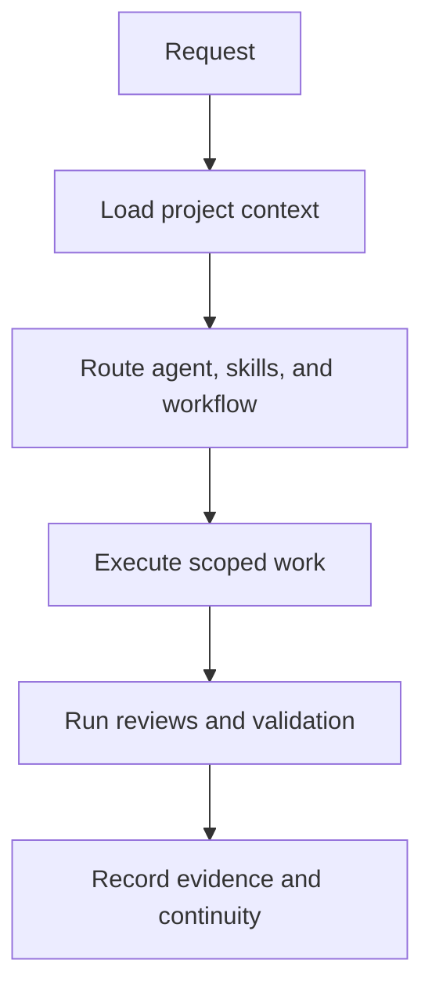

# ATLAS AI Engineering Framework

> Repository-native operating system for AI-assisted software engineering.
> ATLAS gives Claude Code and Codex shared project memory, specialist roles,
> repeatable workflows, governance contracts, and verifiable continuity.

**Version:** `0.1.1`
**Status:** Stable · **License:** MIT

[Installation](docs/installation.md) ·
[Daily Quickstart](docs/daily-quickstart.md) ·
[Agent Catalog](docs/agent-catalog.md) ·
[Skill Catalog](docs/skill-catalog.md) ·
[Operations Guide](docs/operations-guide.md) ·
[Documentation Index](docs/INDEX.md)

## Who it is for

AI coding sessions are productive, but projects lose quality when important
decisions live only in chat history, every session starts from zero, or each
runtime interprets the project differently. ATLAS keeps the operating context
inside the repository so work remains portable, reviewable, and resumable.

ATLAS is designed for individual engineers and teams using AI coding runtimes
on projects where architecture, business constraints, manual deployment,
auditability, or cross-session handoff matter.

## What it solves

ATLAS helps a project:

- preserve validated knowledge, decisions, constraints, and ownership;
- route work to focused agents instead of relying on one generic persona;
- reuse bounded skills and repeatable workflows;
- protect architecture and behavior with contracts, reviews, policies, and tests;
- continue work across sessions without depending on conversation history;
- move between Claude Code and Codex without forking project meaning;
- produce checkpoints, handoffs, evidence, deployment receipts, and release bundles;
- apply cumulative or incremental updates safely, including manual deployment.

## What ATLAS is

ATLAS is a framework that governs an AI coding runtime. It is not a hosted
agent, a replacement for source control, or an autonomous executor.

The runtime still reads files, edits code, runs commands, and interacts with
tools. ATLAS provides the durable knowledge and operating procedures that tell
the runtime how to do that work consistently.

| Layer | Purpose | Canonical location |
| --- | --- | --- |
| Knowledge | Project memory, decisions, constraints, ownership, and continuity | `.claude/memory/`, `docs/`, ADRs |
| Capabilities | Specialist agents, reusable skills, commands, and adapters | `.claude/agents/`, `.claude/skills/`, `.claude/commands/` |
| Execution | Workflows, task envelopes, checkpoints, handoffs, and evidence | `.claude/workflows/`, templates, schemas |
| Governance | Contracts, reviews, policies, tests, and release gates | `.claude/contracts/`, `.claude/reviews/`, `policies/`, `tests/` |

Claude Code is the canonical runtime. Codex is a supported compatibility
runtime under `adapters/codex/`. Runtime adapters translate form and
invocation; they do not create separate memory or redefine contracts.

## Capability inventory

ATLAS ships a broad engineering roster and a reusable capability library. Every
agent and skill has an individual description derived from its canonical YAML
frontmatter.

| Component | Count | What it provides | Complete reference |
| --- | ---: | --- | --- |
| Agents | 87 | Orchestration plus focused product, engineering, architecture, governance, runtime, and assurance roles | [Agent Catalog](docs/agent-catalog.md) |
| Skills | 88 | Bounded procedures for analysis, design, validation, continuity, and delivery | [Skill Catalog](docs/skill-catalog.md) |
| Commands | 71 | Explicit entry points for common ATLAS operations | `.claude/commands/` |
| Workflows | 76 | Repeatable execution paths with responsibilities and gates | `.claude/workflows/` |
| Reviews | 68 | Independent review procedures and acceptance checks | `.claude/reviews/` |
| Contracts | 6 | Stable interfaces for agents, skills, workflows, memory, reviews, and commands | `.claude/contracts/` |

### Agent model

The `orchestrator` classifies complex work, selects the closest specialists,
sequences dependencies, and consolidates delivery. Specialists own bounded
responsibilities such as frontend engineering, architecture, security,
documentation, release integrity, project memory, or runtime parity.

Examples:

- `frontend-engineer` implements accessible and maintainable web interfaces;
- `security-engineer` reviews trust boundaries, auth, secrets, and abuse risks;
- `project-memory-curator` maintains portable, current project knowledge;
- `release-integrity-engineer` verifies versions, manifests, checksums, and provenance;
- `runtime-parity-reviewer` checks semantic parity between supported runtimes.

See the [Agent Catalog](docs/agent-catalog.md) for all 87 descriptions.

### Skill model

Skills are reusable, focused procedures that agents or runtimes invoke when
their trigger conditions match the task. They load only when needed and remain
independent from a single conversation.

Examples:

- `architecture-assessment` evaluates boundaries and architectural fit;
- `api-contract-analysis` identifies compatibility and migration risks;
- `execution-checkpointing` captures resumable task state;
- `manual-deployment-preflight` verifies a manual patch before mutation;
- `dual-runtime-validation` checks Claude Code and Codex surfaces together.

See the [Skill Catalog](docs/skill-catalog.md) for all 88 descriptions.

## How a task moves through ATLAS



A typical task starts with repository state and relevant memory, receives an
explicit route, follows the closest workflow, passes proportional quality
gates, and ends with evidence that another session or runtime can inspect.

## Validate and start

### 1. Install dependencies

```bash
python -m pip install --requirement requirements-test.txt
```

### 2. Validate the framework

```bash
python scripts/validate_all.py --profile quick
```

Use the full profile when changing runtime adapters, policies, generated
catalogs, documentation, or release behavior:

```bash
python scripts/validate_all.py --profile full
```

### 3. Start from the repository root

Claude Code loads `CLAUDE.md`, which imports the shared `AGENTS.md`
instructions. Codex starts from `AGENTS.md` and the adapter entry points under
`adapters/codex/commands/`.

Before implementation, inspect current project memory and choose the closest
command under `.claude/commands/`. The
[Daily Quickstart](docs/daily-quickstart.md) shows one complete work cycle.

## Use with Claude Code

Claude Code is the canonical ATLAS runtime. Start it from the repository root
so it loads `CLAUDE.md`, the shared `AGENTS.md` instructions, project memory,
native agents, skills, commands, workflows, and hooks. See the
[Claude Code Bootstrap Guide](docs/claude-code-bootstrap-guide.md).

## Use with Codex

Codex follows `AGENTS.md` and uses generated adapter entry points under
`adapters/codex/`. Those catalogs map back to the same canonical agents,
skills, workflows, contracts, and memory used by Claude Code. See the
[Codex Adoption Guide](docs/codex-adoption-guide.md).

## Installation options

### Dedicated or empty repository

Use a cumulative release archive, open its single versioned root, and copy the
contents into the target repository. Confirm that `.claude/registry.json`,
`VERSION`, `README.md`, and `LICENSE` exist.

### Existing product repository

Do not overwrite an existing project with the cumulative archive. Generate a
read-only adoption plan and review every collision:

```bash
python scripts/plan_project_adoption.py \
  --target-root <existing-project> \
  --output adoption-plan.json \
  --markdown-output adoption-plan.md
```

Merge project-owned files such as `README.md`, `AGENTS.md`, `CLAUDE.md`,
`.gitignore`, and existing memory deliberately.

### Claude Code marketplace

The repository contains one canonical plugin manifest and one marketplace
catalog at the repository root:

```text
.claude-plugin/
├── plugin.json
└── marketplace.json
```

Install from the Git repository:

```bash
claude plugin marketplace add Vinicius-Merces/atlas
claude plugin install atlas@atlas-marketplace
```

Confirm the loaded inventory:

```bash
claude plugin details atlas@atlas-marketplace
```

### Claude Cloud ZIP upload

Download the repository with **Code → Download ZIP** and upload that archive
directly. The repository intentionally contains exactly one `plugin.json`, so
the same source supports Git marketplace synchronization and ZIP installation.

## Update manually

Incremental packages expose files intended for `.claude/` through the visible
package-only directory `CLAUDE-DIRECTORY/`. Copy those paths into the target
`.claude/` directory and apply only the additions, replacements, and deletions
declared by the patch.

Run the mandatory preflight before changing the installed repository:

```bash
python scripts/manual_deploy_preflight.py \
  --installed-root <installed-repository> \
  --patch-root <extracted-patch> \
  --output <preflight-report.json>
```

See the [Installation Guide](docs/installation.md) and
[Manual Deployment Guide](docs/manual-deployment-guide.md).

## Project structure

```text
.
├── .claude/           # Canonical Claude runtime, memory, agents, skills, workflows
├── .claude-plugin/    # Single plugin manifest and marketplace catalog
├── adapters/          # Codex and experimental runtime translations
├── compatibility/     # Runtime matrix, support, and compatibility policy
├── docs/              # User, operator, architecture, and capability documentation
├── framework/         # Runtime-neutral principles and system models
├── policies/          # Machine-readable governance rules
├── schemas/           # Contracts for task, continuity, evidence, and release data
├── scripts/           # Validation, generation, packaging, and maintenance tools
├── templates/         # Reusable task and project artifacts
└── tests/             # Contract, conformance, smoke, adapter, and release tests
```

## Continuity and project memory

ATLAS separates durable knowledge from temporary execution state:

- durable memory records validated facts, decisions, constraints, and ownership;
- task envelopes define scope, risk, acceptance criteria, and dependencies;
- checkpoints preserve resumable execution state;
- handoffs transfer active work between sessions or runtimes;
- evidence links conclusions to repository state and validation results.

Store confirmed project knowledge under `.claude/memory/`. Do not store
secrets, temporary logs, or unverified assumptions as durable memory.

## Hooks and safeguards

ATLAS currently ships two conservative hooks:

- `PreToolUse` blocks creation of unrequested top-level Markdown or text files;
- `SessionEnd` reminds the runtime to capture a checkpoint or closeout.

Marketplace and ZIP installations load
`.claude/hooks/plugin-hooks.json`, which resolves scripts from the plugin root.
Project-local operation retains `.claude/hooks/hooks.json`.

## Generated documentation

Agent and skill catalogs are generated from canonical frontmatter, preventing
their human-readable descriptions from drifting from runtime routing metadata:

```bash
python scripts/generate_capability_catalogs.py
python scripts/generate_capability_catalogs.py --check
```

The check is part of the portable validation runner.

## Build releases

```bash
python scripts/build_release.py --kind cumulative
python scripts/build_release.py --kind recovery
python scripts/build_incremental_release.py --base <directory-or-git-ref>
python scripts/validate_release_artifacts.py --archive <archive.zip>
```

Release builders package the authoritative worktree, create internal manifests,
and verify final archives with external checksums. Inspect `git status` before
building; untracked, non-ignored files may become part of the payload.

## Support and limitations

| Runtime | Support level |
| --- | --- |
| Claude Code | Canonical and supported |
| Codex | Compatibility runtime and supported |
| Gemini | Experimental |
| Cursor | Experimental |

Runtime tool names and invocation differ by design. Support commitments,
limitations, deprecation rules, and compatibility boundaries are defined in the
[Support Policy](compatibility/support-policy.md) and
[Runtime Matrix](compatibility/runtime-matrix.md).

## Contribute

Read `AGENTS.md`, relevant project memory, applicable contracts, and the
closest workflow before changing the framework. Preserve canonical paths and
semantics, add validation proportional to risk, update generated documentation,
and record evidence for externally visible results.

Start with the [Documentation Index](docs/INDEX.md) for the complete guide set.
