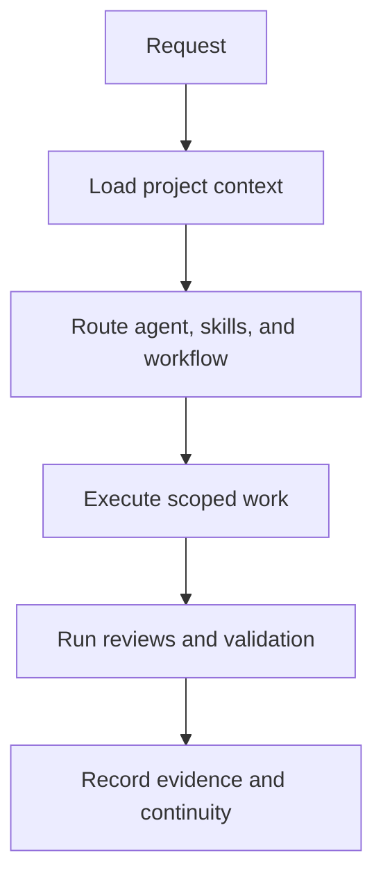

# ATLAS AI Engineering Framework

> Repository-native operating system for AI-assisted software engineering.
> ATLAS gives Claude Code and Codex shared project memory, specialist roles,
> repeatable workflows, governance contracts, frontend craft standards,
> production trust and web assurance gates, and verifiable continuity.

**Version:** `0.1.1`
**Status:** Stable · **License:** MIT

[Installation](docs/installation.md) ·
[Daily Quickstart](docs/daily-quickstart.md) ·
[Agent Catalog](docs/agent-catalog.md) ·
[Skill Catalog](docs/skill-catalog.md) ·
[Operations Guide](docs/operations-guide.md) ·
[Documentation Index](docs/INDEX.md)

## Who it is for

AI coding sessions are productive, but projects lose quality when important
decisions live only in chat history, every session starts from zero, each runtime
interprets the project differently, technically correct frontend work collapses
into generic template patterns, a SaaS feature reaches production with unverified
trust boundaries, or a public site ships without real browser and search-facing
evidence.

ATLAS keeps the operating context inside the repository so work remains portable,
reviewable, resumable, and governed by the same quality model across sessions.

ATLAS is designed for individual engineers and teams using AI coding runtimes on
projects where architecture, business constraints, frontend quality, production
trust, public-web discoverability, integrations, manual deployment, auditability,
or cross-session handoff matter.

## What it solves

ATLAS helps a project:

- preserve validated knowledge, decisions, constraints, and ownership;
- route work to focused agents instead of relying on one generic persona;
- reuse bounded skills and repeatable workflows;
- protect architecture and behavior with contracts, reviews, policies, and tests;
- continue work across sessions without depending on conversation history;
- move between Claude Code and Codex without forking project meaning;
- produce checkpoints, handoffs, evidence, deployment receipts, and release bundles;
- apply cumulative or incremental updates safely, including manual deployment;
- build user-facing interfaces with explicit visual direction, responsive evidence,
  purposeful motion/3D, performance budgets, and independent craft review;
- review authentication, authorization, tenant/data isolation, secrets, webhooks,
  payments, and external API failure behavior before production approval;
- prove critical browser journeys, technical crawl/index behavior, structured-data
  truth, and dependency/build supply-chain risk before public-web release claims.

## What ATLAS is

ATLAS is a framework that governs an AI coding runtime. It is not a hosted agent,
a replacement for source control, or an autonomous executor.

The runtime still reads files, edits code, runs commands, and interacts with tools.
ATLAS provides the durable knowledge and operating procedures that tell the runtime
how to do that work consistently.

| Layer | Purpose | Canonical location |
| --- | --- | --- |
| Knowledge | Project memory, decisions, constraints, ownership, continuity, and capability navigation | `.claude/memory/`, `docs/`, ADRs |
| Capabilities | Specialist agents, reusable skills, commands, capability overlays, and adapters | `.claude/agents/`, `.claude/skills/`, `.claude/commands/`, `framework/capabilities/` |
| Execution | Workflows, task envelopes, checkpoints, handoffs, and evidence | `.claude/workflows/`, templates, schemas |
| Governance | Contracts, reviews, policies, tests, and release gates | `.claude/contracts/`, `.claude/reviews/`, `policies/`, `tests/` |

Claude Code is the canonical runtime. Codex is a supported compatibility runtime
under `adapters/codex/`. Runtime adapters translate form and invocation; they do
not create separate memory or redefine contracts.

## Capability inventory

ATLAS ships a broad engineering roster and a reusable capability library. Every
registered agent and skill has canonical discovery metadata derived from YAML
frontmatter and validated in CI.

| Component | Count | What it provides | Complete reference |
| --- | ---: | --- | --- |
| Agents | 87 | Orchestration plus focused product, engineering, architecture, governance, runtime, and assurance roles | [Agent Catalog](docs/agent-catalog.md) |
| Skills | 107 | Bounded procedures for analysis, design, frontend craft, production trust, web assurance, validation, continuity, and delivery | [Skill Catalog](docs/skill-catalog.md) |
| Commands | 71 | Explicit entry points for common ATLAS operations | `.claude/commands/` |
| Workflows | 79 | Repeatable execution paths with responsibilities and gates | `.claude/workflows/` |
| Reviews | 71 | Independent review procedures and acceptance checks | `.claude/reviews/` |
| Contracts | 6 | Stable interfaces for agents, skills, workflows, memory, reviews, and commands | `.claude/contracts/` |

### Agent model

The `orchestrator` classifies complex work, selects the closest specialists,
sequences dependencies, and consolidates delivery. Specialists own bounded
responsibilities such as frontend engineering, architecture, security,
documentation, release integrity, project memory, or runtime parity.

Examples:

- `frontend-engineer` implements maintainable, accessible, responsive, visually
  intentional, and search-aware public interfaces;
- `security-engineer` reviews identity, authorization, tenant/data boundaries,
  secrets, provider trust, dependency supply-chain risk, and abuse risks;
- `backend-engineer` implements server-side contracts, data access, authorization,
  idempotent state transitions, and failure behavior;
- `integration-engineer` owns provider contracts, webhooks, retries, idempotency,
  rate limits, and reconciliation;
- `qa-engineer` independently validates acceptance behavior and rendered public-web
  evidence;
- `dependency-manager` governs dependency deltas, sources, advisories, scripts,
  maintenance risk, and rollback paths;
- `project-memory-curator` maintains portable, current project knowledge;
- `release-integrity-engineer` verifies versions, manifests, checksums, and provenance;
- `runtime-parity-reviewer` checks semantic parity between supported runtimes.

See the [Agent Catalog](docs/agent-catalog.md) for all 87 descriptions.

### Skill model

Skills are reusable, focused procedures that agents or runtimes invoke when their
trigger conditions match the task. They load only when needed and remain
independent from a single conversation.

Examples:

- `architecture-assessment` evaluates boundaries and architectural fit;
- `api-contract-analysis` identifies compatibility and migration risks;
- `execution-checkpointing` captures resumable task state;
- `manual-deployment-preflight` verifies a manual patch before mutation;
- `frontend-stack-selection` chooses CSS, Motion, GSAP, Three.js/R3F, and supporting
  frontend tools by evidence rather than trend;
- `frontend-craft-review` independently checks whether a UI is product-specific or
  still looks generic/template-driven;
- `authorization-boundary-review` checks object/action permissions, ownership,
  roles, admin paths, and tenant boundaries using direct negative evidence;
- `webhook-reliability-review` validates signatures, retries, duplicates, replay,
  ordering, durable acceptance, and recovery;
- `payment-integration-review` validates server-authoritative financial state,
  idempotency, entitlements, refunds, and provider reconciliation;
- `browser-flow-validation` proves release-critical journeys in a rendered browser;
- `seo-technical-audit` verifies deployed crawl/index/canonical/robots/sitemap behavior;
- `structured-data-validation` checks schema markup against authoritative page facts;
- `supply-chain-risk-audit` reviews dependency/build deltas, advisories, executable
  scripts, source/provenance, and blast radius;
- `dual-runtime-validation` checks Claude Code and Codex surfaces together.

See the [Skill Catalog](docs/skill-catalog.md) for all 107 descriptions.

## Discovery descriptions and hover surfaces

Every ATLAS agent and skill has one canonical `description` in YAML frontmatter.
That description is the routing label and the human-facing discovery text used by
ATLAS catalogs and runtime adapters.

For agents, `.claude/agents/<agent>.md` is the canonical source. For skills,
`.claude/skills/<skill>/SKILL.md` is canonical and `.agents/skills/` preserves the
same `name` and `description` for Codex-native skill discovery.

When Claude Code, Codex, or another supported runtime exposes a picker, tooltip,
hover card, recommendation surface, or similar discovery UI, ATLAS supplies this
canonical description as the purpose text. The exact visual behavior of hover or
picker UI remains controlled by the runtime version itself; ATLAS guarantees the
metadata source and cross-runtime semantic parity rather than inventing a second
UI-only label.

Discovery metadata is enforced automatically:

```bash
python scripts/validate_discovery_metadata.py
```

The validator fails when a registered agent or skill has no description, declares
the wrong name, exceeds the discovery-description limit, duplicates another
purpose description, loses a Codex wrapper, or lets Codex skill metadata drift
from the canonical skill.

## Frontend Craft

ATLAS includes a dedicated frontend-quality model for projects where merely
"working" is not enough.

The canonical model lives at:

```text
framework/frontend-craft-model.md
framework/capabilities/frontend-craft.yaml
```

The frontend delivery path is:

```text
product / brand intent
        ↓
interface-visual-direction
        ↓
frontend-stack-selection
        ↓
component architecture + implementation
        ↓
motion-choreography          when applicable
immersive-3d-experience      when justified
        ↓
responsive-layout-audit
        ↓
visual-regression-review
        ↓
web-performance-field-readiness
        ↓
independent frontend-craft-review
```

The stack policy is intentionally selective:

- use CSS/browser capabilities for simple local behavior;
- prefer Motion for React-owned gestures, enter/exit, layout, and shared-layout transitions;
- prefer GSAP for coordinated timelines, complex sequencing, ScrollTrigger,
  pinning, scrubbing, and multi-region choreography;
- use Three.js or React Three Fiber only when genuine spatial rendering adds product,
  interaction, or narrative value and passes explicit performance/fallback checks.

The model also defines an anti-template / anti-AI-default standard. Patterns such
as generic pill-badge heroes, unjustified bento grids, repeated equal rounded cards,
glass/neon effects used as automatic premium signals, identical fade-up sequences,
decorative 3D, or untouched component-library defaults require a product, UX,
content, or brand justification rather than appearing automatically.

Significant frontend work follows `.claude/workflows/frontend-feature-delivery.md`
and may require the independent `.claude/reviews/frontend-craft-review.md` gate.
Critical or High craft findings block approval.

## SaaS Production Trust

ATLAS includes a vendor-neutral production-trust model for SaaS features that
handle identities, protected resources, tenant data, privileged configuration,
asynchronous provider events, payments, or third-party APIs.

The canonical model and capability overlay live at:

```text
framework/saas-production-trust-model.md
framework/capabilities/saas-production-trust.yaml
```

The trust path is cumulative:

```text
identity
  ↓
authentication
  ↓
authorization
  ↓
data / tenant isolation
  ↓
secret + environment boundaries
  ↓
webhook + provider reliability
  ↓
payment / entitlement consistency
  ↓
observability + recovery
  ↓
independent SaaS production trust review
```

The pack provides seven focused capabilities:

- `authentication-flow-review` for sign-in/sign-up, recovery, MFA, SSO/OAuth/OIDC,
  sessions, callbacks, and account linking;
- `authorization-boundary-review` for role, ownership, tenant, resource/action,
  admin, API, and service-identity permissions;
- `row-level-security-review` for PostgreSQL/Supabase RLS, grants, policies, views,
  service-role bypasses, and cross-tenant negative testing;
- `secret-environment-audit` for API keys, database URLs, signing secrets, CI/CD
  credentials, public/private runtime configuration, rotation, and leakage paths;
- `webhook-reliability-review` for signature verification, replay, duplicate delivery,
  ordering, idempotency, retries, durable acceptance, and recovery;
- `payment-integration-review` for checkout, subscriptions, refunds, entitlements,
  idempotent mutations, provider events, and reconciliation;
- `external-api-resilience-review` for deadlines, retry budgets, rate limits,
  pagination, versioning, provider outages, degradation, and reconciliation.

Authentication is explicitly not treated as authorization. UI visibility is not
an access-control boundary. Environment variables are an injection mechanism, not
proof that a value is secret. A successful checkout redirect is not durable payment
or entitlement evidence. Provider success paths are insufficient without retry,
duplicate, timeout, outage, and reconciliation behavior.

Significant SaaS changes follow `.claude/workflows/saas-production-readiness.md`
and require the independent `.claude/reviews/saas-production-trust-review.md` gate
when the risk is material. Unresolved Critical or High production-trust findings
block approval.

## Web Production Assurance

ATLAS includes a public-web assurance model for release evidence that sits beside,
not inside, frontend craft and SaaS trust.

The canonical model and capability overlay live at:

```text
framework/web-production-assurance-model.md
framework/capabilities/web-production-assurance.yaml
```

The assurance path is:

```text
route / release intent
        ↓
supply-chain delta when dependencies or build inputs changed
        ↓
critical rendered browser journeys
        ↓
deployed HTTP + crawl/index/canonical evidence
        ↓
structured-data truth and validation when present
        ↓
independent web-production-assurance-review
```

The pack provides four focused capabilities:

- `browser-flow-validation` for critical navigation, forms, auth state, routing,
  async behavior, direct URL/refresh, console/network/runtime errors, and retained
  failure diagnostics in a real browser;
- `seo-technical-audit` for status codes, redirects, canonical URLs, `robots.txt`,
  robots meta/X-Robots-Tag, sitemaps, rendering, internal discovery, and metadata;
- `structured-data-validation` for JSON-LD/Microdata/RDFa syntax, canonical entity
  identity, factual page-content consistency, and current feature validation;
- `supply-chain-risk-audit` for direct/transitive dependency changes, registries,
  advisories/malware evidence, lifecycle scripts, CI/build inputs, provenance,
  maintenance signals, blast radius, and rollback/removal paths.

The model explicitly avoids false guarantees. Technical SEO evidence does not
promise ranking or indexing, valid schema does not promise a rich result, and a
clean dependency scan does not prove the absence of supply-chain risk. `robots.txt`
is crawl control rather than access control or confidential-data protection.

Significant public-web releases follow `.claude/workflows/web-production-assurance.md`
and use the independent `.claude/reviews/web-production-assurance-review.md` gate.
Critical or High findings, or missing mandatory release evidence, prevent an
unconditional approval.

## How a task moves through ATLAS



A typical task starts with repository state and relevant memory, receives an
explicit route, follows the closest workflow, passes proportional quality gates,
and ends with evidence that another session or runtime can inspect.

## Validate and start

### 1. Install dependencies

```bash
python -m pip install --requirement requirements-test.txt
```

### 2. Validate the framework

```bash
python scripts/validate_all.py --profile quick
```

The quick profile includes registry validation, agent taxonomy, discovery metadata,
Frontend Craft Pack validation, SaaS Production Trust Pack validation, Web
Production Assurance Pack validation, generated catalog checks, package checks,
and contract validation.

Use the full profile when changing runtime adapters, policies, generated catalogs,
documentation, or release behavior:

```bash
python scripts/validate_all.py --profile full
```

### 3. Start from the repository root

Claude Code loads `CLAUDE.md`, which imports the shared `AGENTS.md` instructions.
Codex starts from `AGENTS.md` and the adapter entry points under
`adapters/codex/commands/`.

Before implementation, inspect current project memory and choose the closest
command under `.claude/commands/`. The [Daily Quickstart](docs/daily-quickstart.md)
shows one complete work cycle.

## Use with Claude Code

Claude Code is the canonical ATLAS runtime. Start it from the repository root so
it loads `CLAUDE.md`, the shared `AGENTS.md` instructions, project memory, native
agents, skills, commands, workflows, and hooks. See the
[Claude Code Bootstrap Guide](docs/claude-code-bootstrap-guide.md).

## Use with Codex

Codex follows `AGENTS.md` and uses generated adapter entry points under
`adapters/codex/`. Those catalogs map back to the same canonical agents, skills,
workflows, contracts, and memory used by Claude Code. Codex-native skills under
`.agents/skills/` preserve canonical discovery descriptions. See the
[Codex Adoption Guide](docs/codex-adoption-guide.md).

## Installation options

### Dedicated or empty repository

Use a cumulative release archive, open its single versioned root, and copy the
contents into the target repository. Confirm that `.claude/registry.json`,
`VERSION`, `README.md`, and `LICENSE` exist.

### Existing product repository

Do not overwrite an existing project with the cumulative archive. Generate a
read-only adoption plan and review every collision:

```bash
python scripts/plan_project_adoption.py \
  --target-root <existing-project> \
  --output adoption-plan.json \
  --markdown-output adoption-plan.md
```

Merge project-owned files such as `README.md`, `AGENTS.md`, `CLAUDE.md`,
`.gitignore`, and existing memory deliberately.

### Claude Code marketplace

The repository contains one canonical plugin manifest and one marketplace catalog
at the repository root:

```text
.claude-plugin/
├── plugin.json
└── marketplace.json
```

Install from the Git repository:

```bash
claude plugin marketplace add Vinicius-Merces/atlas
claude plugin install atlas@atlas-marketplace
```

Confirm the loaded inventory:

```bash
claude plugin details atlas@atlas-marketplace
```

### Claude Cloud ZIP upload

Download the repository with **Code → Download ZIP** and upload that archive
directly. The repository intentionally contains exactly one `plugin.json`, so the
same source supports Git marketplace synchronization and ZIP installation.

## Update manually

Incremental packages expose files intended for `.claude/` through the visible
package-only directory `CLAUDE-DIRECTORY/`. Copy those paths into the target
`.claude/` directory and apply only the additions, replacements, and deletions
declared by the patch.

Run the mandatory preflight before changing the installed repository:

```bash
python scripts/manual_deploy_preflight.py \
  --installed-root <installed-repository> \
  --patch-root <extracted-patch> \
  --output <preflight-report.json>
```

See the [Installation Guide](docs/installation.md) and
[Manual Deployment Guide](docs/manual-deployment-guide.md).

## Project structure

```text
.
├── .agents/           # Runtime-native Agent Skills compatibility surface for Codex
├── .claude/           # Canonical Claude runtime, memory, agents, skills, workflows
├── .claude-plugin/    # Single plugin manifest and marketplace catalog
├── adapters/          # Codex and experimental runtime translations
├── compatibility/     # Runtime matrix, support, and compatibility policy
├── docs/              # User, operator, architecture, research, and capability docs
├── framework/         # Runtime-neutral principles, capability overlays, and models
├── policies/          # Machine-readable governance rules
├── schemas/           # Contracts for task, continuity, evidence, and release data
├── scripts/           # Validation, generation, packaging, and maintenance tools
├── templates/         # Reusable task and project artifacts
└── tests/             # Contract, conformance, smoke, adapter, and release tests
```

## Continuity and project memory

ATLAS separates durable knowledge from temporary execution state:

- durable memory records validated facts, decisions, constraints, and ownership;
- task envelopes define scope, risk, acceptance criteria, and dependencies;
- checkpoints preserve resumable execution state;
- handoffs transfer active work between sessions or runtimes;
- evidence links conclusions to repository state and validation results;
- capability navigation in Obsidian helps agents understand who owns what without
  creating a second source of truth.

Store confirmed project knowledge under `.claude/memory/`. Do not store secrets,
temporary logs, or unverified assumptions as durable memory.

## Hooks and safeguards

ATLAS currently ships two conservative hooks:

- `PreToolUse` blocks creation of unrequested top-level Markdown or text files;
- `SessionEnd` reminds the runtime to capture a checkpoint or closeout.

Marketplace and ZIP installations load `.claude/hooks/plugin-hooks.json`, which
resolves scripts from the plugin root. Project-local operation retains
`.claude/hooks/hooks.json`.

## Generated documentation

Agent and skill catalogs are generated from canonical frontmatter, preventing
their human-readable descriptions from drifting from runtime routing metadata:

```bash
python scripts/generate_capability_catalogs.py
python scripts/generate_capability_catalogs.py --check
python scripts/validate_discovery_metadata.py
```

These checks are part of the portable validation runner.

## Build releases

```bash
python scripts/build_release.py --kind cumulative
python scripts/build_release.py --kind recovery
python scripts/build_incremental_release.py --base <directory-or-git-ref>
python scripts/validate_release_artifacts.py --archive <archive.zip>
```

Release builders package the authoritative worktree, create internal manifests,
and verify final archives with external checksums. Inspect `git status` before
building; untracked, non-ignored files may become part of the payload.

## Support and limitations

| Runtime | Support level |
| --- | --- |
| Claude Code | Canonical and supported |
| Codex | Compatibility runtime and supported |
| Gemini | Experimental |
| Cursor | Experimental |

ATLAS guarantees canonical purpose descriptions and adapter parity. The exact
visual rendering of picker/hover/tooltip UI is owned by each runtime and may vary
between runtime versions.

Runtime tool names and invocation differ by design. Support commitments,
limitations, deprecation rules, and compatibility boundaries are defined in the
[Support Policy](compatibility/support-policy.md) and
[Runtime Matrix](compatibility/runtime-matrix.md).

## Contribute

Read `AGENTS.md`, relevant project memory, applicable contracts, and the closest
workflow before changing the framework. Preserve canonical paths and semantics,
add validation proportional to risk, update generated documentation, and record
evidence for externally visible results.

New agents and skills must include discriminative discovery descriptions. A change
that removes, duplicates, or desynchronizes those descriptions should fail the
validation pipeline.

Start with the [Documentation Index](docs/INDEX.md) for the complete guide set.
